# State Machine & Activity Diagrams (Draw.io / PlantUML)

The diagrams below use **PlantUML**. In draw.io: **Arrange → Insert → Advanced → PlantUML** (or **+ → Advanced → PlantUML**), paste each code block and insert.

---

## 1. State Machine Diagrams (Main Entities)

### 1.1 Map (MapStatusEnum)

Map UGC state flow: Draft → Submit for review → Approve/Reject → Publish.

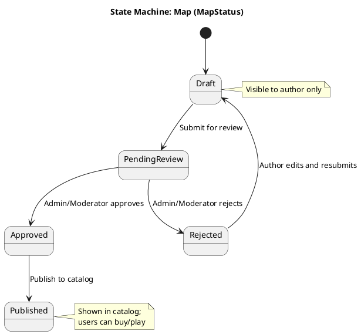

---

### 1.2 Payment Record (PaymentStatusEnum)

Payment transaction status (PayOS, OrbitCoin, map/package purchase).

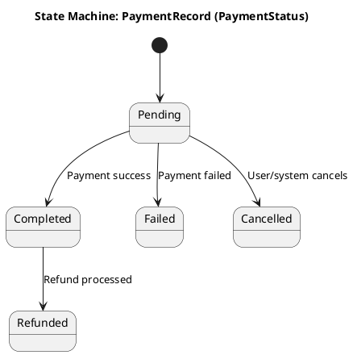

---

### 1.3 Map Report (ReportStatusEnum)

Map content report status, handled by Admin/Moderator.

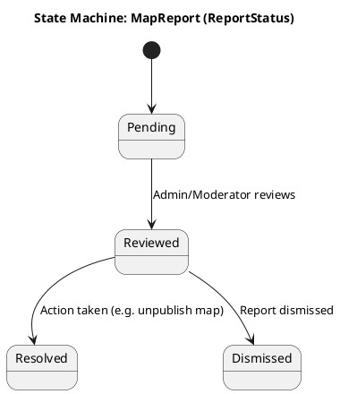

---

### 1.4 Room (RoomStatusEnum)

Competitive match room status.

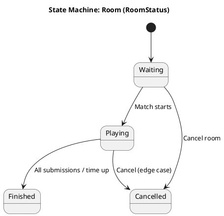

---

### 1.5 Submission (SubmissionStatusEnum)

Submission (solution) status when the user runs a map.

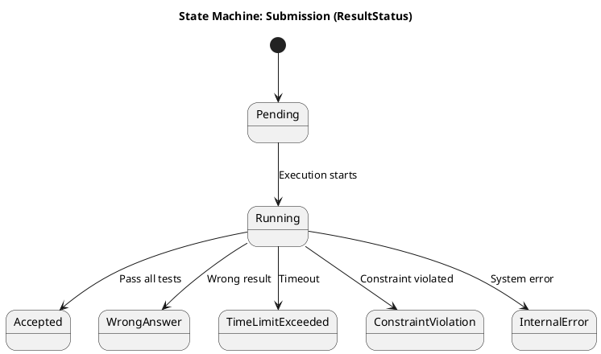

---

## 2. Activity Diagrams / Flowcharts (Main Business Flows)

Main business flows with Actors; internal application processing is not detailed.

---

### 2.1 Deposit → OrbitCoin via PayOS

User deposits real money; system (PayOS webhook or confirm) credits OrbitCoin to wallet.

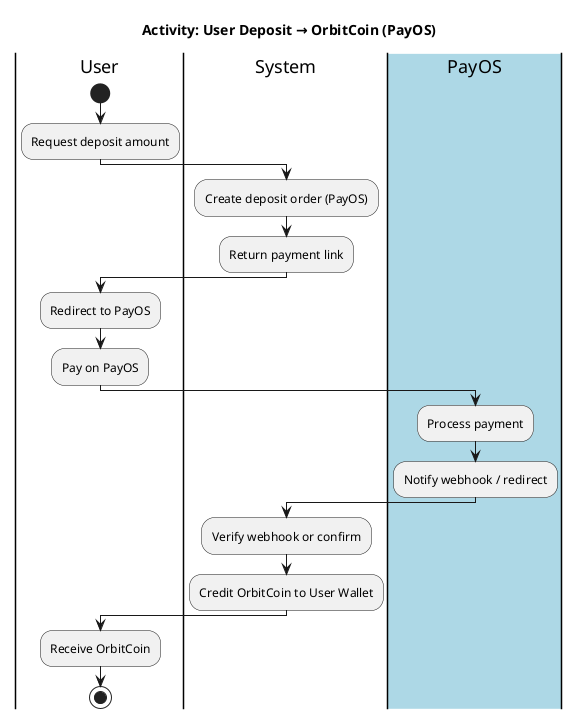

---

### 2.2 Purchase Map with OrbitCoin

User (Buyer) purchases map; Seller receives amount minus platform fee.

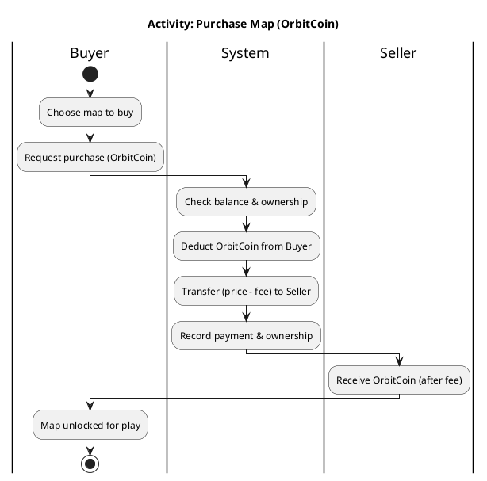

---

### 2.3 Purchase Package (membership)

User purchases Free/Pro/Creator package with OrbitCoin.

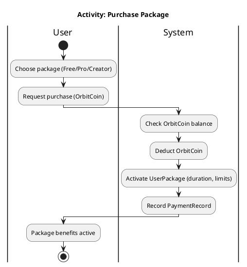

---

### 2.4 Create and Publish Map (UGC) – with approval

Creator creates map and submits for review; Admin/Moderator approves or rejects; only Admin/Moderator can publish an Approved map to the catalog. If rejected, this flow ends; the creator may start a new submission (edit and resubmit) from the application.

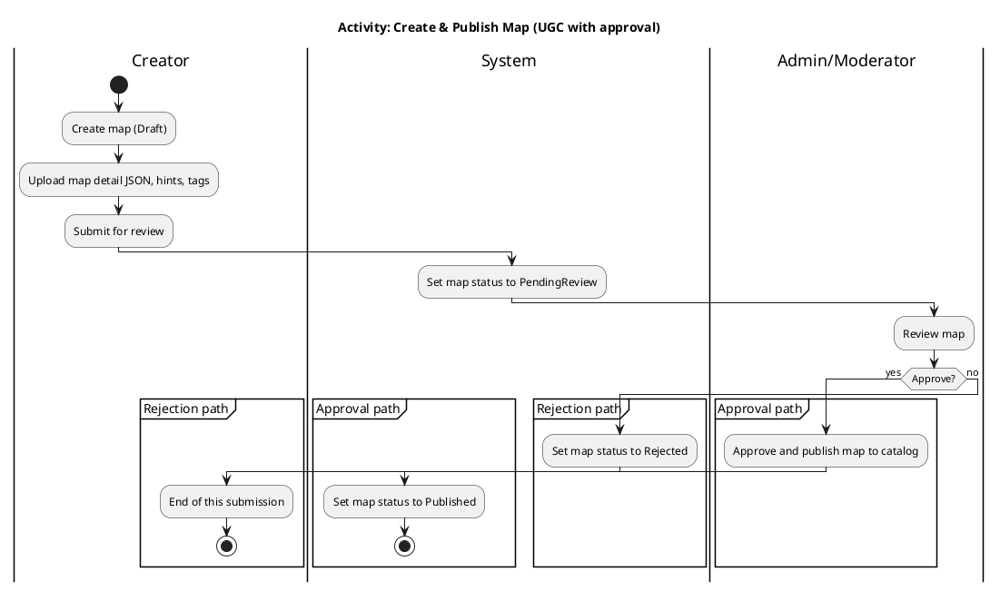

---

### 2.5 Play Map and Submit Solution (Play & Submit)

User plays map (owned or free), submits solution; system evaluates and updates XP/Stars.

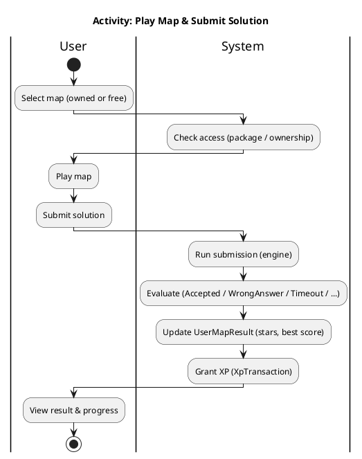

---

### 2.6 Report Map → Admin handling

User reports map violation; Admin/Moderator reviews and resolves (Resolved / Dismissed). If dismissed, this flow ends; the user may submit a new report from the application.

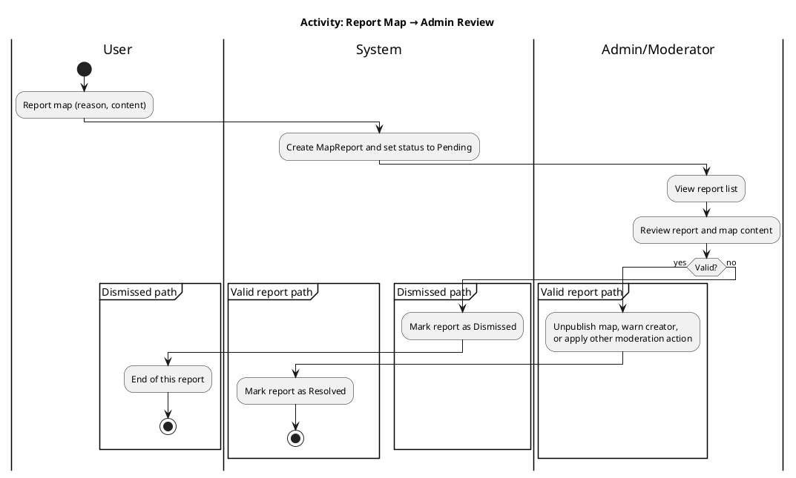

---

### 2.7 Join Competitive Room / Match

User creates or joins a room, waits for enough players, match starts, submit solution, finish and view results.

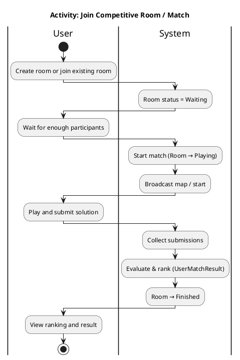

---

## How to use in draw.io

1. Open draw.io.
2. **Insert → Advanced → PlantUML** (or **+ → Advanced → PlantUML** depending on version).
3. Copy the full content of one code block (from `@startuml` to `@enduml`), paste into the PlantUML box.
4. Click **Insert** to generate the diagram.
5. Repeat for each diagram you need.

If PlantUML is not available in draw.io, install the **PlantUML** add-on (Extensions / Integrations).
